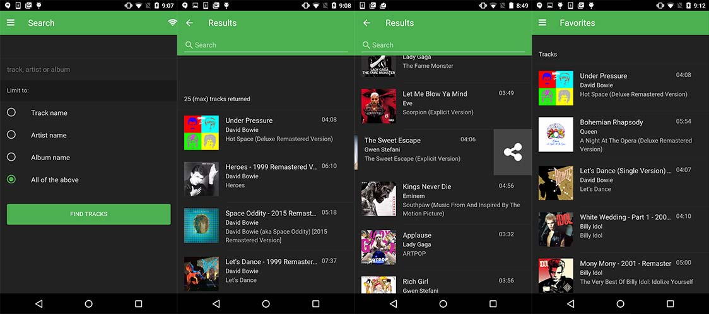

## What You Will Learn
In this workshop we will walk through several lessons designed to point out specific things you should learn
about building hybrid mobile apps using a sample template developed by the PhoneGap team called
[Star Track](https://github.com/phonegap/phonegap-app-star-track/).  This app interacts with the [Spotify Web API](https://developer.spotify.com/web-api/) and was built with [Framework7](http://framework7.io), a mobile
UI framework. The chosen framework could have been anything but the goal was to use something with a familiar
syntax and since Framework7 has a built-in DOM manipulation library with the same syntax as jQuery, it's the
easiest to get started with. We will enhance the Star Track app with some additional features and the resulting
app can be found in this [Digital Marketing Summit Star Track repo](https://github.com/macdonst/summit-phonegap-supercharge) from my github.

We will focus less on the Framework7 library and more on the certain aspects of mobile development you should be
most aware of when building hybrid apps in general. This includes best practices and performance techniques as well as adding and using Cordova plugins to add additional functionality that will enhance your apps and provide a more native experience.

The sample app project is located on my associated
GitHub repo [here](https://github.com/macdonst/summit-phonegap-supercharge).

## Dependencies
We will be using PhoneGap, [Framework7](http://framework7.io) and the [Font Awesome Icon Font library](http://fortawesome.github.io/Font-Awesome/)
 to help us build this app. The following plugins are also used in the final version.

      <plugin name-"phonegap-plugin-push" spec="~1.9.0" />
      <plugin name-"cordova-plugin-dialogs" spec="~1.3.0" />
      <plugin name-"cordova-plugin-device" spec="~1.1.0" />
      <!-- previously installed -->
      <plugin name="cordova-plugin-whitelist" spec="~1.2.0" />
      <plugin name="cordova-plugin-statusbar" spec="~2.1.3" />
      <plugin name="cordova-plugin-media" spec="~1.0.1" />
      <plugin name="cordova-plugin-console" spec="~1.0.1" />
      <plugin name="cordova-plugin-x-socialsharing" spec="~5.0.12" />
      <plugin name="cordova-plugin-network-information" spec="~1.2.1" />

## What You Will Learn
- How to enhance your application by adding the ability to receive push notifications.
- Understanding user behavior better with analytics.
- Modify the native application files or running build tasks with hooks.
- Picking a UI framework to help accelerate your app development.
- How to interact with PhoneGap Build.
- DEBUGGING!!!

## Requirements
- PhoneGap CLI 6.2.3 or greater (`npm install -g phonegap`)
> PhoneGap CLI 6.2.2 had a bug that could interfere with certain parts of this workshop so please ensure you're not using
that version. To check simply run the command `phonegap -v`.
- A code editor, a modern browser, and a connection to the Internet.
- A working knowledge of HTML and JavaScript is assumed, but you don't need to be a JavaScript guru.

>A mobile device or a Mobile SDK is **not** a requirement for this tutorial. You will able to test your application in the browser or with the
[PhoneGap Developer App](http://docs.phonegap.com/getting-started/2-install-mobile-app/) with some limitations. If you want the full support of the native APIs then you will need the mobile
SDK for that platform (iOS SDK, Android SDK, etc.) installed on your system.

## Useful Resources
1. [Simple Spotify Browser](http://hollyschinsky.github.io/spotify-browser) - a tutorial to walk you through build out a simple spotify browser (different than Star Track) from start to finish with helpful lessons along the way.
2. [Pocket Guide](http://hollyschinsky.github.io/pocket-guide) - a similar app and workshop with a vanilla approach to a single page architecture and walks through specific
tips and tricks to make your app feel and perform natively outside of a specific UI framework doing the work for you.
3. [PhoneGap Workshop](http://hollyschinsky.github.io/phonegap-workshop) - a similar app with a workshop that goes step by step creating the routing, templates and views to understand Single Page Architecture.
4. [Conference Tracker](http://hollyschinsky.github.io/ConferenceTracker) - a conference app built with Ionic/AngularJS with some more advanced features

## Issues/Feedback
- Please create an issue [here](https://github.com/macdonst/summit-phonegap-supercharge/issues) if you run
into any problems or if you have feedback.

- You can also use the Comments section at the bottom of each module to ask a question or report a problem.

- You can contact us on Twitter:

    <a href="https://twitter.com/macdonst" class="twitter-follow-button" data-show-count="true"
    data-size="large" data-lang="en">Follow
    @macdonst</a>
    

    <a href="https://twitter.com/stevesgill" class="twitter-follow-button" data-show-count="true"
    data-size="large" data-lang="en">Follow
    @stevesgill</a>
    

## Slides
[Presentation Slides](https://github.com/macdonst/summit-phonegap-supercharge/blob/gh-pages/preso/www/index.html)

<a href="lesson1.html" class="btn btn-default pull-right">Next <i class="glyphicon
glyphicon-chevron-right"></i></a>

