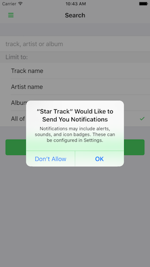

### Overview
In order for your device to receive push notifications you will need to receive a registration ID from the remote push service be it Google Cloud Messaging (GCM), Firebase Cloud Messaging (FCM) or Apple Push Notification Service (APNS). We'll learn how to register for push and report that registration ID back to our application server.

## Requirements
Before you can code this feature, you'll first need to add the [PhoneGap Push Plugin](https://github.com/phonegap/phonegap-plugin-push) to your project since it is not yet used in the Star Track base app template.

1. Open your terminal and use the PhoneGap CLI to add it now (the `--save` parameter will save the plugin to your `config.xml` file):

       phonegap plugin add phonegap-plugin-push --variable SENDER_ID=XXXXXXXX --save

   >Be sure to visit the [PhoneGap Push Plugin Docs](https://github.com/phonegap/phonegap-plugin-push) to learn about any platform quirks and more things you can do with this plugin.

## Steps
1. Initialize the PushNotification plugin and register an event handler for a `registration` event. Open the **www/js/my-app.js** file
and add the following function to the end of the file:

        function setupPush() {
          var push = PushNotification.init({
              "android": {
                  "senderID": "XXXXXXXX"
              },
              "ios": {
                "sound": true,
                "alert": true,
                "badge": true
              },
              "windows": {}
          });

          push.on('registration', function(data) {
              console.log("registration event: " + data.registrationId);
              var oldRegId = localStorage.getItem('registrationId');
              if (oldRegId !== data.registrationId) {
                  // Save new registration ID
                  localStorage.setItem('registrationId', data.registrationId);
                  // Post registrationId to your app server as the value has changed
              }
          });

          push.on('error', function(e) {
              console.log("push error = " + e.message);
          });
        }

   > You may be wondering why we are checking the registration ID against one we saved in local storage. Basically, Apple or Google may refresh your registration ID so it always pays to see if the ID has changed. You can use this opportunity to remove an old ID from your app server and add the new ID.

2. Next in the **www/js/my-app.js** file, find the `deviceready` handling section and modify it so it calls our `setupPush` method.

        $$(document).on('deviceready', function deviceIsReady() {
          console.log('Device is ready!');
          setupPush();
        });

3. Next refresh the application by using the [four finger tap gesture](http://docs.phonegap.com/references/developer-app/gestures/). Once your app reloads, if this is the first time you are requesting the ability to receive push notifications on iOS you will see the following dialog. Please click the `OK` button.
    

   > If you are running on Android or have already given permission to the app to use push notifications then you will not see this dialog.

4. Finally, you will see the registration ID in your terminal session.

        [phonegap] [console.log] registration event: APA91bE1MmeTc92igNoi5OkDWUV

   > Obviously, your registration ID will be different but you get the picture.

## Useful Resources
1. [Apache Cordova and Remote Debugging on Android](http://geeklearning.io/apache-cordova-and-remote-debugging-on-android/) - a quick tutorial on how to setup your phone to allow remote debugging with Chrome Web Inspector.
2. [Debugging PhoneGap Apps with Safari's Web Inspector](http://phonegap-tips.com/articles/debugging-ios-phonegap-apps-with-safaris-web-inspector.html) - a quick tutorial on how to setup your phone to allow remote debugging with Safari Web Inspector.

### Dependencies

   [PhoneGap Push Plugin](https://github.com/phonegap/phonegap-plugin-push)

    $ phonegap plugin add phonegap-plugin-push --variable SENDER_ID=XXXXXXXX

   >You won't need to specifically add it for this workshop as it is already included in the **PhoneGap Developer App**. If you are creating the project from scratch and using the CLI locally then use the command above.

<a href="lesson1.html" class="btn btn-default"><i class="glyphicon glyphicon-chevron-left"></i> Previous</a>
<a href="lesson3.html" class="btn btn-default pull-right">Next <i class="glyphicon
glyphicon-chevron-right"></i></a>

