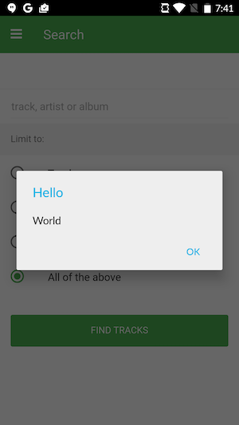
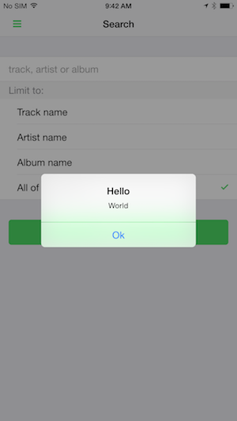
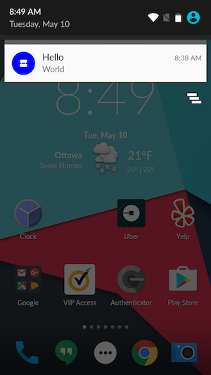
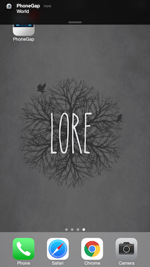

### Overview
Now that we have a registration ID we are now ready to receive our push notification in our app. In this case we'll setup our application to show a dialog when a push notification is received.

## Steps
1. Open **www/js/my-app.js** and add the following code after the push error handler in `setupPush`:

            push.on('notification', function(data) {
                console.log('notification event');
                navigator.notification.alert(
                    data.message,         // message
                    null,                 // callback
                    data.title,           // title
                    'Ok'                  // buttonName
                );
            });

2. Next refresh the application by using the [four finger tap gesture](http://docs.phonegap.com/references/developer-app/gestures/).

Now when a notification message is received while the app is the foreground your UI will automatically update.

If your app is in the background then the notification will live in the shade and once your user clicks on the notification, the notification handler will be run and your UI will be updated.

> It's very important to note that your notification handler does not **normally** run when your app is in the background. We'll discuss how to modify your app when it is in the background in a later module.

### Dependencies

   [Apache Cordova Dialog Plugin](https://github.com/apache/cordova-plugin-dialogs)

    $ phonegap plugin add cordova-plugin-dialogs

   >You won't need to specifically add it for this workshop as it is already included in the **PhoneGap Developer App**. If you are creating the project from scratch and using the CLI locally then use the command above.

<a href="lesson2.html" class="btn btn-default"><i class="glyphicon glyphicon-chevron-left"></i> Previous</a>
<a href="lesson4.html" class="btn btn-default pull-right">Next <i class="glyphicon
glyphicon-chevron-right"></i></a>

