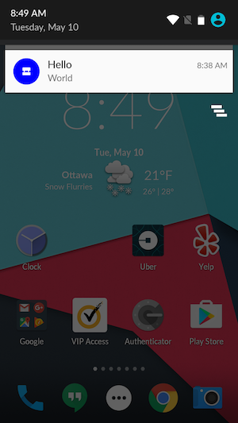
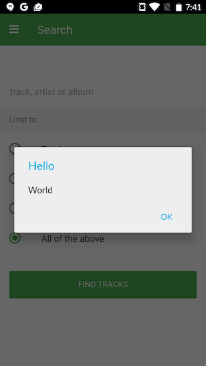
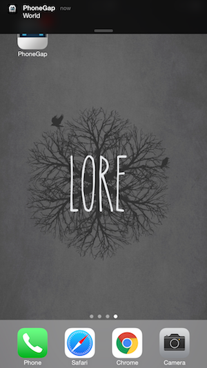
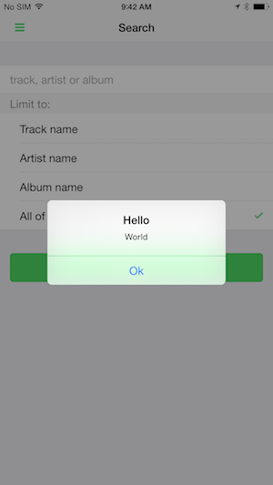

### Overview
Now that we have an app that is able to receive push notifications we have to have some way to be able to send a notification to the app. The push plugin will work with a number of third party push services including but not limited to [Amazon SNS](https://aws.amazon.com/sns/?sc_channel=PS&sc_campaign=acquisition_CA&sc_publisher=google&sc_medium=sns_b&sc_content=sns_e&sc_detail=amazon%20sns&sc_category=sns&sc_segment=64743194096&sc_matchtype=e&sc_country=CA&s_kwcid=AL!4422!3!64743194096!e!!g!!amazon%20sns&ef_id=VFewPgAAAJQIwLbC:20160121142959:s), [Parse](http://parse.com/), [DevicePush](http://www.devicepush.com/) and [Ionic Push](https://apps.ionic.io/landing/push) we are just going to use the push command of the PhoneGap CLI.

## Steps
1. Open a new terminal window.

2. If you are on Android device or browser you will run the following command to send your test push replacing the device ID with the one you obtained in module 2:

   Mac Terminal:

        phonegap push --deviceID APA91bE1MmeTc92igNoi5OkDWUV --service gcm --payload '{ "data": { "title": "Hello", "message": "World"} }'

   Windows CMD Prompt:

        phonegap push --deviceID APA91bE1MmeTc92igNoi5OkDWUV --service gcm --payload "{ \"data\":{ \"title\": \"Hello\", \"message\": \"World\"} }"

   If you are on a iOS device you will run the following command to send your test push:

   Mac Terminal:

    phonegap push --deviceID APA91bE1MmeTc92igNoi5OkDWUV --service apns --payload '{ "aps": { "alert": { "title": "Hello", "body": "World" } } }'

   Windows CMD Prompt:

    phonegap push --deviceID APA91bE1MmeTc92igNoi5OkDWUV --service apns --payload "{ \"aps\": { \"alert\": { \"title\": \"Hello\", \"body\": \"World\" } } }"

> Obviously, you'll need to replace "APA91bE1MmeTc92igNoi5OkDWUV" with the registration ID you obtained in Module 2.

<a href="lesson3.html" class="btn btn-default"><i class="glyphicon glyphicon-chevron-left"></i> Previous</a>
<a href="lesson5.html" class="btn btn-default pull-right">Next <i class="glyphicon
glyphicon-chevron-right"></i></a>

