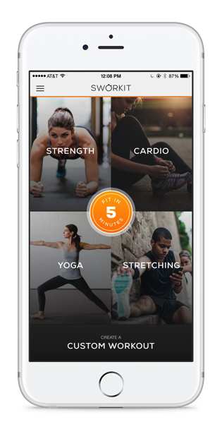
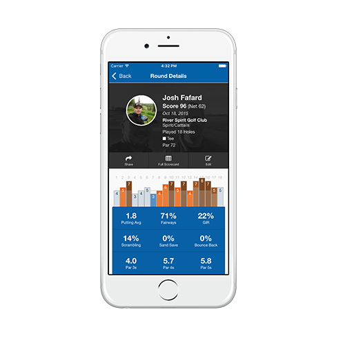
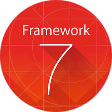
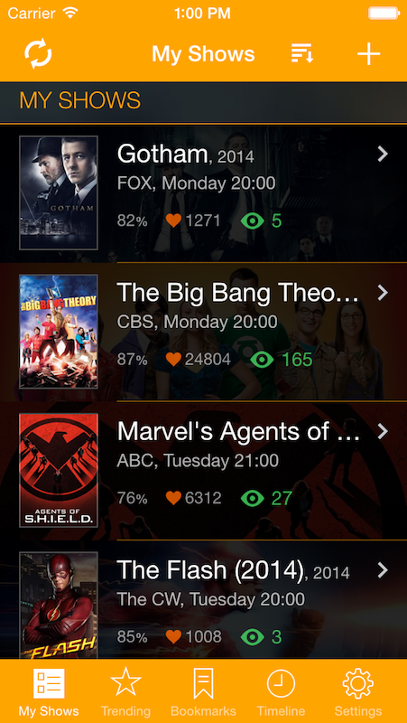

## Overview
If you are anything like me you are CSS challenged and the design you dream up in your head:

doesn't always match what you produce in reality.

Luckily, some very intelligent folks who are way better at design have already done the hard work and developed some excellent frameworks we can pick up and use. Let's investigate a few of them.

## Frameworks

### Ionic

Ionic is an open-source SDK for hybrid mobile app development. Built on top of AngularJS and Apache Cordova, Ionic provides tools and services for developing hybrid mobile apps using Web technologies like CSS, HTML5, and Sass.

**Pros**

* Provides iOS, Android and Windows themes.
* The framework is backed by a huge community with over 28,000 stars on Github.
* Ionic contains a powerful CLI with tons of features which wraps the Apache Cordova CLI for packaging native apps.

**Cons**

* The framework is very opinionated and forces you to use Typekit and Angular2.

### Onsen

Onsen UI is an open-source UI framework and components for HTML5 hybrid mobile app development, based on PhoneGap/Apache Cordova. It allows developers to create mobile apps using Web technologies like CSS, HTML5, and JavaScript. Onsen UI is JavaScript framework-agnostic, meaning developers can create mobile apps with pure JavaScript, AngularJS, Angular 2, React, Vue.js and Meteor.

**Pros**

* Provides iOS and Android themes.
* Developers are given multiple options when including UI components into an app.
* Onsen provides a CLI and web tools which wraps the Apache Cordova CLI for packaging native apps.

**Cons**

* With so many options of how to include the UI components it is difficult knowing where to start.
* Some of framework features can't be used unless you make use of Onsen UI's HTML-based IDE.

### Framework7

Framework7 is an open source mobile HTML framework to develop hybrid mobile apps or web apps with iOS & Android native look and feel. The main approach of the Framework7 is to give you an opportunity to create iOS & Android apps with HTML, CSS and JavaScript free and clear.

**Pros**

* Provides iOS and Android themes.
* Two options for including web components a jQuery like API for developers familiar with that style of JavaScript coding and a reactive API based on Vue.js.
* Lack of strong opinion makes it easier to insert into your existing workflow.
* Popular framework with over 9,000 stars on Github.

**Cons**

* It does not include mobile app builders such as PhoneGap or Apache Cordova.

<a href="lesson6.html" class="btn btn-default"><i class="glyphicon glyphicon-chevron-left"></i> Previous</a>
<a href="lesson8.html" class="btn btn-default pull-right">Next <i class="glyphicon
glyphicon-chevron-right"></i></a>

