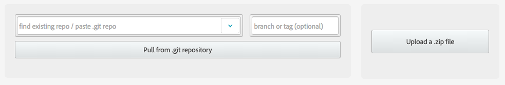
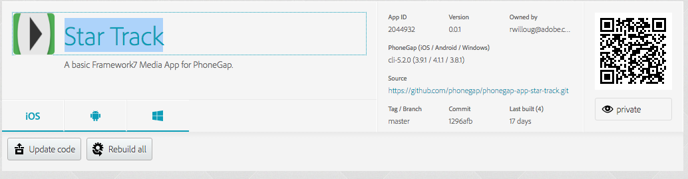

### Overview
PhoneGap Build is a cloud service for compiling PhoneGap applications. Benefits include:

* Managed Compilation and Signing (No SDKs): Local development involves installing and maintaining multiple native SDKs as well as the Cordova/PhoneGap SDK. PhoneGap Build takes this headache away!
* Multiple Supported Platforms: Target iOS, Android, Windows (Phone) all with a single codebase. As a web-service, PhoneGap Build may be used from any OS.

## Requirements
Before you can build an app on PhoneGap Build you will need to create an [Adobe ID](https://adobeid-na1.services.adobe.com/renga-idprovider/pages/create_account?client_id=SunbreakWebUI1&callback=https%3A%2F%2Fims-na1.adobelogin.com%2Fims%2Fadobeid%2FSunbreakWebUI1%2FAdobeID%2Ftoken%3Fredirect_uri%3Dhttps%253A%252F%252Faccounts.adobe.com%252F%2523from_ims%253Dtrue%2526old_hash%253D%2526api%253Dauthorize%2526reauth%253Dforce%26scope%3DAdobeID%252Copenid%252Csunbreak%252Cacct_mgmt_webui%252Cgnav%252Cadditional_info.account_type%252Csao.cce_private%252Ccreative_cloud%252Cread_countries_regions%252Cupdate_profile.password%252Cadditional_info.roles%252Cupdate_profile.optionalAgreements%252Cupdate_profile.change_password%252Cadditional_info.social%252Csocial.link%252Cunlink_social_account%252Creauthenticated&client_redirect=https%3A%2F%2Fims-na1.adobelogin.com%2Fims%2Fredirect%2FSunbreakWebUI1%3Fclient_redirect%3Dhttps%253A%252F%252Faccounts.adobe.com%252F%2523from_ims%253Dtrue%2526old_hash%253D%2526api%253Dauthorize%2526reauth%253Dforce&denied_callback=https%3A%2F%2Fims-na1.adobelogin.com%2Fims%2Fdenied%2FSunbreakWebUI1%3Fredirect_uri%3Dhttps%253A%252F%252Faccounts.adobe.com%252F%2523from_ims%253Dtrue%2526old_hash%253D%2526api%253Dauthorize%2526reauth%253Dforce%26response_type%3Dtoken%26scope%3DAdobeID%252Copenid%252Csunbreak%252Cacct_mgmt_webui%252Cgnav%252Cadditional_info.account_type%252Csao.cce_private%252Ccreative_cloud%252Cread_countries_regions%252Cupdate_profile.password%252Cadditional_info.roles%252Cupdate_profile.optionalAgreements%252Cupdate_profile.change_password%252Cadditional_info.social%252Csocial.link%252Cunlink_social_account%252Creauthenticated&display=web_v2&locale=en_US&relay=4d97549d-9bfb-4bd7-8ab0-c611bb8eb1fb&flow=true&flow_type=token&idp_flow_type=login&reauthenticate=force).

### Interacting with PhoneGap Build

#### Using the Web Interface
Zip up the contents of the `www` directory and `config.xml`, then upload it to [PhoneGap Build](https://build.phonegap.com).

Once your builds complete, scan with your QR code and install.

#### Using the CLI

Lets build our app using the command line interface:

    phonegap remote login
    phonegap remote build android

Navigate to PhoneGap Build and find your app:

Scan with your QR code and install.

>To learn more about PhoneGap Build check out the [PhoneGap Build Workshop](http://wildabeast.github.io/phonegap-day-workshop/index.html).

<a href="lesson7.html" class="btn btn-default"><i class="glyphicon glyphicon-chevron-left"></i> Previous</a>
<a href="lesson9.html" class="btn btn-default pull-right">Next <i class="glyphicon
glyphicon-chevron-right"></i></a>

